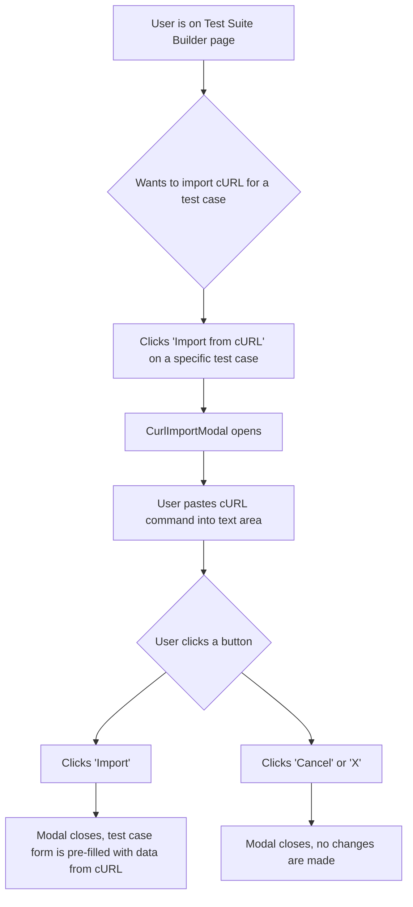

# Plan: Custom UI for "Import from cURL"

This document outlines the design and component plan for a new custom UI for the "Import from cURL" feature, replacing the native browser prompt.

## 1. Objective

The goal is to create a user-friendly and visually consistent modal for pasting and importing a cURL command. This will improve the user experience compared to the current native browser prompt.

## 2. Component Design: `CurlImportModal.tsx`

A new reusable React component will be created at `frontend/src/components/modals/CurlImportModal.tsx`.

### Props

The component will accept the following props:

*   `isOpen` (boolean): Controls the visibility of the modal.
*   `onClose` (function): A callback function to close the modal.
*   `onImport` (function): A callback function that passes the cURL command string back to the parent component when the "Import" button is clicked.

### State

The component will manage its own internal state:

*   `curlCommand` (string): Stores the content of the text area.

### Structure (JSX)

The modal will have the following structure:

*   A container `div` for the modal overlay (to dim the background).
*   A `div` for the modal content itself.
*   A header with a `h3` title "Import from cURL" and a close button (e.g., an 'X' icon).
*   A body section containing a large `textarea` for the cURL command.
*   A footer section with two buttons:
    *   "Cancel": Closes the modal (`onClose`).
    *   "Import": Submits the cURL command (`onImport`).

## 3. Integration with `TestSuiteBuilder.tsx`

The new `CurlImportModal` component will be integrated into the `TestSuiteBuilder.tsx` component.

1.  **State Management:** New state variables will be added to `TestSuiteBuilder.tsx` to manage the modal's visibility and track which test case is being edited:
    ```typescript
    const [isCurlModalOpen, setIsCurlModalOpen] = useState(false);
    const [activeTestCaseIndex, setActiveTestCaseIndex] = useState<number | null>(null);
    ```

2.  **Triggering the Modal:** The existing "Import from cURL" button's `onClick` handler will be modified. Instead of calling `handleImportCurlForTestCase` directly, it will set the state to open the modal and store the current test case index.
    ```jsx
    // Inside the map function for test cases
    <button
      type="button"
      onClick={() => {
        setActiveTestCaseIndex(index);
        setIsCurlModalOpen(true);
      }}
      className="secondary"
    >
      Import from cURL
    </button>
    ```

3.  **Rendering the Modal:** The `CurlImportModal` will be rendered within `TestSuiteBuilder.tsx`.
    ```jsx
    <CurlImportModal
      isOpen={isCurlModalOpen}
      onClose={() => setIsCurlModalOpen(false)}
      onImport={(curlCommand) => {
        if (activeTestCaseIndex !== null) {
          handleImportFromCurl(curlCommand, activeTestCaseIndex);
        }
        setIsCurlModalOpen(false);
      }}
    />
    ```

4.  **Updating the Logic:** The `handleImportCurlForTestCase` function will be renamed to `handleImportFromCurl` and will now accept the `curlCommand` and `index` as arguments instead of prompting for the command. The core parsing logic within the function will remain the same.

    ```typescript
    const handleImportFromCurl = (curlCommand: string, index: number) => {
      if (curlCommand) {
        // ... (existing parsing logic from handleImportCurlForTestCase)
      }
    };
    ```

## 4. User Flow

The new user flow will be as follows:



## 5. Next Steps

Once this plan is approved, the next step is to switch to "Code" mode to:
1.  Create the new file `frontend/src/components/modals/CurlImportModal.tsx`.
2.  Implement the `CurlImportModal` component as described above.
3.  Modify `frontend/src/components/test-suites/TestSuiteBuilder.tsx` to integrate and use the new modal, replacing the browser prompt functionality.