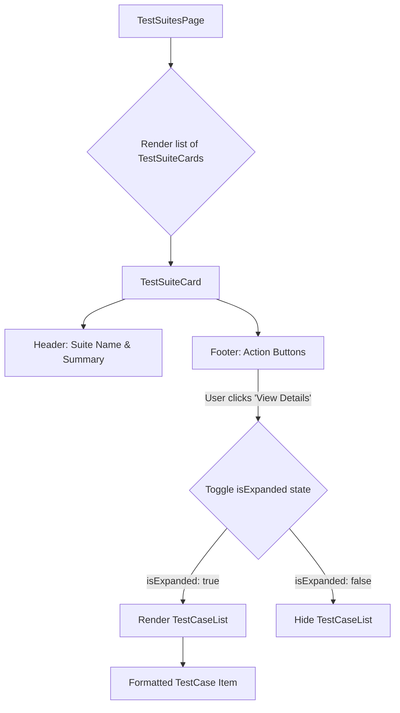

# Test Suites Page Redesign Plan

This document outlines the design plan for a cleaner, more organized layout for the Test Suites page.

## 1. The Problem

The current Test Suites page is cluttered. When a user clicks "View Details," the test cases are displayed in a raw list that is difficult to read and disrupts the layout. This redesign aims to solve that by introducing a card-based layout and an accordion for displaying test case details.

## 2. High-Level Plan

- **Card-Based Layout:** Each test suite will be represented as a self-contained card, providing a clear and organized view.
- **Accordion for Details:** Test cases will be displayed within an accordion, revealed only when the user clicks "View Details."
- **Clear Actions:** Action buttons ("View Details," "Run," "Edit," "Delete") will be standardized and easily accessible on each card.

## 3. Component Breakdown

This section will detail the new and modified components required for the redesign.
### 3.1. TestSuiteCard Component

This new component will be the core of the redesigned layout.

- **Structure:**
  - A container `div` with a border and box-shadow to create the "card" effect.
  - **Header:**
    - `h3` for the test suite name.
    - `span` for the summary (e.g., "5 APIs").
  - **Body (Accordion):**
    - The body will contain the `TestCaseList` component, which will be conditionally rendered when the accordion is open.
  - **Footer (Actions):**
    - A `div` containing the action buttons: "View Details," "Run," "Edit," and "Delete."

### 3.2. Accordion Interaction

- **State:** The `TestSuiteCard` component will manage a local state variable (e.g., `isExpanded`) to control the accordion's visibility.
- **"View Details" Button:**
  - When clicked, this button will toggle the `isExpanded` state.
  - The button's text should change to "Close" or "Hide Details" when the accordion is open.
- **`TestCaseList` Component:**
  - This existing component will be reused inside the accordion.
  - Each test case should be formatted for clarity:
    - **`[GET]`** `/api/users`
    - **`[POST]`** `/api/products`

## 4. Workflow Diagram

A Mermaid diagram will be included here to visualize the user flow and component interactions.
